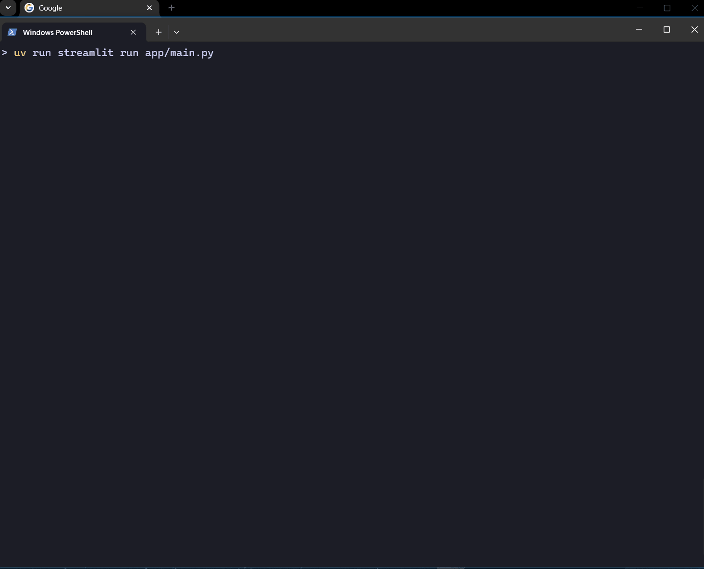

# RAG Pipeline – End-to-End Retrieval-Augmented Generation System

This project implements a complete Retrieval-Augmented Generation (RAG) pipeline.
It crawls external documentation, ingests and embeds content using Google Gemini, stores vector embeddings in Pinecone, and exposes a Streamlit interface for natural‑language question answering with source citations.

The goal is to demonstrate a modular, maintainable, and realistic RAG system similar to production environments.



---

## Features

### Web Crawling and Ingestion
- Uses Tavily for crawling external URLs
- Extracts content and applies recursive chunking
- Generates embeddings with Google’s `text-embedding-004` model (configurable)
- Stores embeddings in Pinecone for vector search

### Retrieval and LLM Orchestration
- Retrieves the most relevant chunks from Pinecone
- Generates structured answers using Gemini
- Includes source citations for transparency
- Clean, modular retrieval pipeline in `backend/core.py`
- Heuristic reranking and selection in `backend/selection.py`

### Streamlit Interface
- Minimal UI for interacting with the RAG system
- Chat history preservation
- Clear presentation of answers and sources

### FastAPI Service
- Exposes ingestion, search, and QA endpoints
- Container-friendly API for integrating with the UI

### Engineering Practices
- Separation of ingestion, retrieval, and UI components
- Environment-driven configuration via `.env`
- Logging utilities for debugging and monitoring
- Optional LangSmith tracing support

---

## Architecture

```text
Crawling --> Chunking --> Embeddings --> Pinecone Vector Store
                                             |
                                             v
                                     Retriever + LLM
                                             |
                                             v
                                      FastAPI API
                                             |
                                             v
                                      Streamlit UI
```

---

## Project Structure

```text
rag-pipeline/
  backend/
    core.py          # RAG pipeline logic (retrieval + generation)
    ingestion.py     # Crawling, chunking, embeddings, indexing
    logger.py        # Logging helpers
    __init__.py
  app/
    main.py          # Streamlit UI
    __init__.py
  .env.example
  README.md
  uv.lock
```

---

## Environment Configuration

Create your local environment file:

```bash
cp .env.example .env
```

Fill in your values:

```bash
#############################
# Observability (LangSmith)
#############################
LANGSMITH_TRACING=true
LANGSMITH_ENDPOINT=https://api.smith.langchain.com
LANGSMITH_PROJECT=Documentation Helper
LANGSMITH_API_KEY=<api_key>

#############################
# Crawling
#############################
TAVILY_API_KEY=<api_key>

#############################
# Vector DB (Pinecone)
#############################
PINECONE_API_KEY=<api_key>
INDEX_NAME=langchain-docs-2025

#############################
# Gemini (Embeddings)
#############################
GEMINI_API_KEY=<api_key>
EMBEDDING_MODEL=gemini-embedding-001

#############################
# Providers (LLM + Embeddings)
#############################
LLM_PROVIDER=ollama
EMBEDDINGS_PROVIDER=ollama

#############################
# Ollama (Local)
#############################
OLLAMA_BASE_URL=http://localhost:11434
OLLAMA_MODEL=llama3.1:8b
OLLAMA_EMBED_MODEL=nomic-embed-text:latest

#############################
# OpenAI (Unused in this project)
#############################
OPENAI_API_KEY=<your-openai-api-key>
```

---

## Installation and Running

### Running the Project

Activate your virtual environment and start the application:

### Running the Project (using uv)

# Install dependencies (automatically creates .venv)
```bash
uv sync
```

# Run the ingestion script
```bash
uv run python backend/ingestion.py
```

# Start the Streamlit application
```bash
uv run streamlit run app/main.py
```

## FastAPI Service

Run the API server:

```bash
uv run uvicorn api.main:app --host 0.0.0.0 --port 8000
```

## Docker (API + Streamlit)

Build the image:

```bash
docker build -t rag-api .
```

Run the container:

```bash
docker run --rm -p 8000:8000 rag-api
```

Run with Docker Compose (auto-loads `.env`):

```bash
docker compose up --build
```

By default, local runs use `http://localhost:11434`. Docker Compose overrides
`OLLAMA_BASE_URL` to `http://host.docker.internal:11434` so containers reach
your host Ollama without changing `.env`.

Streamlit UI:

```bash
open http://localhost:8501
```

FastAPI docs:

```bash
open http://localhost:8000/docs
```

API endpoints (see `/docs` for schemas):

- `GET /health` – health check
- `POST /ingest` – ingest raw text
- `POST /search` – semantic search
- `POST /ask` – answer a question
- `POST /crawl` – crawl and ingest a URL

Health check:

```bash
curl http://localhost:8000/health
```


---

## How It Works

1. **Ingestion**
   - Crawls target URLs
   - Splits text into overlapping chunks
   - Generates vector embeddings
   - Writes embeddings and metadata to Pinecone

2. **Retrieval**
   - Queries Pinecone for relevant chunks
   - Sends them to the RAG chain

3. **Generation**
   - Gemini synthesizes an answer
   - Adds citations for verification

4. **User Interface**
   - Streamlit provides a chat-like UI

---

## Future Improvements

- Support additional vector stores (OpenSearch, pgvector)
- Add retrieval-quality evaluation benchmarks
- Add automated tests for ingestion and retrieval
- Add background tasks for large-scale ingestion
