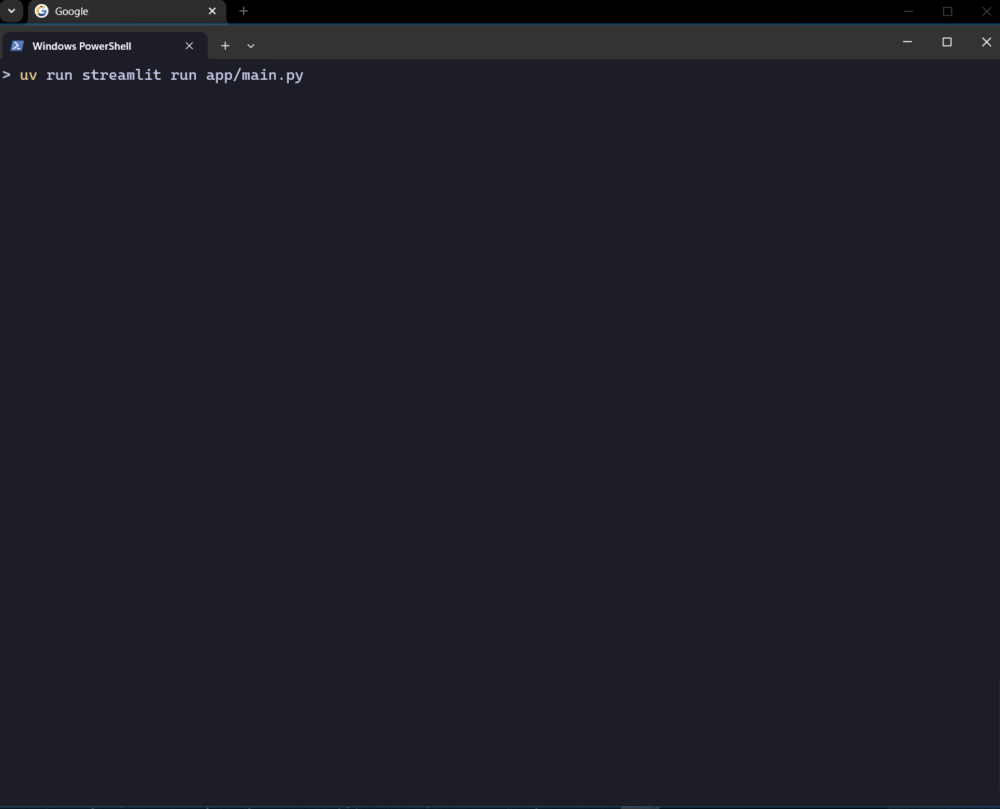

# Documentation Helper

Production-style documentation Q&A system built with FastAPI, Streamlit, LangChain, Pinecone, RabbitMQ, and Redis.

It crawls documentation sites, chunks and embeds content, stores vectors in Pinecone, and serves citation-backed answers through both an API and a lightweight UI. Ingestion runs asynchronously through a queue and worker so the read path stays responsive while crawl and indexing work happens in the background.



## Why This Project Matters

This project focuses on the engineering concerns that matter in production-oriented retrieval systems:

- Asynchronous ingestion with RabbitMQ and a dedicated worker
- Job-state tracking in Redis with polling via `GET /jobs/{job_id}`
- Retrieval guardrails and citation-aware answers
- Provider switching for both LLMs and embeddings (`ollama` or `gemini`)
- Containerized local stack with API, worker, UI, Redis, and RabbitMQ
- Unit and integration tests around API, ingestion, queues, and worker behavior

The system is designed to keep query handling responsive while background ingestion, crawl, and indexing work are processed asynchronously, with support for local or hosted model providers and containerized local infrastructure.

## Architecture

```text
                    +----------------------+
                    |   Streamlit Frontend |
                    |      app/main.py     |
                    +----------+-----------+
                               |
                               v
+-------------+       +--------+---------+       +-------------------+
| API Clients  +------> FastAPI Service  +-------> Pinecone Vector DB |
| curl / apps  |       |   api/main.py   |       +-------------------+
+-------------+       +---+----------+---+                 ^
                           |          |                     |
                           |          +---- /ask, /search --+
                           |
                           +---- /ingest, /crawl
                                      |
                                      v
                             +--------+--------+
                             |    RabbitMQ     |
                             | durable queue   |
                             +--------+--------+
                                      |
                                      v
                             +--------+--------+
                             | background worker|
                             | backend/worker.py|
                             +--------+--------+
                                      |
                                      v
                             +--------+--------+
                             | Redis job store |
                             +-----------------+
```

## Key Capabilities

- Crawl external documentation with Tavily and filter off-domain pages during ingestion
- Split content into chunks and upsert embeddings into Pinecone in batches
- Answer questions with retrieved context and attach citations
- Accept ingest and crawl requests immediately with `202 Accepted`
- Expose job status for async workflows
- Run fully via Docker Compose for local demos

## Tech Stack

- API: FastAPI + Uvicorn
- UI: Streamlit
- Orchestration: LangChain
- Vector store: Pinecone
- Queue: RabbitMQ
- Job state: Redis
- Model providers: Ollama or Google Gemini
- Crawl provider: Tavily
- Testing: Pytest
- Packaging and task runner: `uv`

## Repository Structure

```text
documentation-helper/
  api/
    main.py              # FastAPI endpoints for health, jobs, ingest, crawl, search, ask
    schemas.py           # Request/response contracts
  app/
    main.py              # Streamlit UI for ingest, crawl, and chat
  backend/
    core.py              # Retrieval and answer generation
    ingestion.py         # Crawl, clean, chunk, embed, and index
    jobs.py              # Redis-backed job status storage
    rabbitmq.py          # Queue topology and publish helpers
    selection.py         # Retrieval selection and retry heuristics
    worker.py            # Background job consumer
  tests/
    test_*.py            # Unit and integration coverage
  docker-compose.yml     # Local multi-service stack
  Dockerfile
  pyproject.toml
  README.md
```

## Quick Start

The recommended path for reviewers is Docker Compose because it brings up the API, worker, Redis, RabbitMQ, and Streamlit together.

### 1. Create your environment file

PowerShell:

```powershell
Copy-Item .env.example .env
```

Bash:

```bash
cp .env.example .env
```

Then fill in the provider keys and infrastructure values you want to use.

### 2. Install dependencies for local development

```text
uv sync --dev
```

### 3. Start the full stack

```text
docker compose up --build
```

Services:

- Streamlit UI: `http://localhost:8501`
- FastAPI docs: `http://localhost:8000/docs`
- RabbitMQ management UI: `http://localhost:15672`

### 4. Ask a question or ingest content

Use the UI or hit the API directly.

Health check:

```text
curl http://localhost:8000/health
```

Bash: queue an ingest job

```bash
curl -X POST http://localhost:8000/ingest \
  -H "Content-Type: application/json" \
  -d '{
    "doc_id": "sample-doc",
    "text": "LangChain helps build LLM applications.",
    "metadata": {"source": "manual"}
  }'
```

PowerShell: queue an ingest job

```powershell
$body = @{
  doc_id = "sample-doc"
  text = "LangChain helps build LLM applications."
  metadata = @{
    source = "manual"
  }
} | ConvertTo-Json -Depth 3

Invoke-RestMethod `
  -Method Post `
  -Uri "http://localhost:8000/ingest" `
  -ContentType "application/json" `
  -Body $body
```

Bash: queue a crawl job

```bash
curl -X POST http://localhost:8000/crawl \
  -H "Content-Type: application/json" \
  -d '{
    "url": "https://python.langchain.com/",
    "max_depth": 3,
    "extract_depth": "advanced"
  }'
```

PowerShell: queue a crawl job

```powershell
$body = @{
  url = "https://python.langchain.com/"
  max_depth = 3
  extract_depth = "advanced"
} | ConvertTo-Json

Invoke-RestMethod `
  -Method Post `
  -Uri "http://localhost:8000/crawl" `
  -ContentType "application/json" `
  -Body $body
```

Bash: poll job status

```bash
curl http://localhost:8000/jobs/<job_id>
```

PowerShell: poll job status

```powershell
Invoke-RestMethod -Method Get -Uri "http://localhost:8000/jobs/<job_id>"
```

Bash: ask a question

```bash
curl -X POST http://localhost:8000/ask \
  -H "Content-Type: application/json" \
  -d '{
    "query": "What is LangChain?",
    "top_k": 6
  }'
```

PowerShell: ask a question

```powershell
$body = @{
  query = "What is LangChain?"
  top_k = 6
} | ConvertTo-Json

Invoke-RestMethod `
  -Method Post `
  -Uri "http://localhost:8000/ask" `
  -ContentType "application/json" `
  -Body $body
```

## Running Without Docker

If you want to run services manually, start the dependencies first.

### API

```text
uv run uvicorn api.main:app --host 0.0.0.0 --port 8000
```

### Worker

```text
uv run python -m backend.worker
```

### Streamlit

```text
uv run streamlit run app/main.py
```

Notes:

- `POST /ingest` and `POST /crawl` require RabbitMQ, Redis, and the worker to be running
- `POST /ask` and `POST /search` require a valid Pinecone index plus configured model and embedding providers
- Local development defaults to `OLLAMA_BASE_URL=http://localhost:11434`
- Docker Compose overrides Ollama base URL to `http://host.docker.internal:11434` for container-to-host access

## API Surface

- `GET /health`: readiness check
- `GET /jobs/{job_id}`: fetch current async job state
- `POST /ingest`: enqueue raw text ingestion
- `POST /crawl`: enqueue remote documentation crawl + ingestion
- `POST /search`: semantic search over indexed chunks
- `POST /ask`: retrieve relevant chunks and generate an answer with citations

## Environment Variables

The repo now includes a real `.env.example`. The most important settings are:

### Core Providers

- `LLM_PROVIDER`: `ollama` or `gemini`
- `EMBEDDINGS_PROVIDER`: `ollama` or `gemini`
- `OLLAMA_BASE_URL`
- `OLLAMA_MODEL`
- `OLLAMA_EMBED_MODEL`
- `GEMINI_API_KEY`
- `GEMINI_MODEL`
- `EMBEDDING_MODEL`

### Retrieval and Ingestion

- `INDEX_NAME`
- `CHUNK_SIZE`
- `CHUNK_OVERLAP`
- `BATCH_SIZE`
- `MIN_SOURCES`
- `MIN_TOP_SCORE`
- `NOTE_SCORE_THRESHOLD`
- `NOTE_SCORE_MARGIN`

### Crawl and Queueing

- `TAVILY_API_KEY`
- `RABBITMQ_HOST`
- `RABBITMQ_PORT`
- `RABBITMQ_USER`
- `RABBITMQ_PASSWORD`
- `RABBITMQ_VHOST`
- `RABBITMQ_QUEUE_INGEST`
- `RABBITMQ_EXCHANGE_DEAD_LETTER`
- `RABBITMQ_QUEUE_INGEST_FAILED`
- `WORKER_JOB_MAX_ATTEMPTS`
- `WORKER_RABBITMQ_CONNECT_RETRIES`
- `WORKER_RABBITMQ_RETRY_DELAY_SECONDS`

### Job Storage and UI

- `REDIS_HOST`
- `REDIS_PORT`
- `REDIS_DB`
- `REDIS_JOB_KEY_PREFIX`
- `API_BASE_URL`

### Observability

- `LANGSMITH_TRACING`
- `LANGSMITH_ENDPOINT`
- `LANGSMITH_PROJECT`
- `LANGSMITH_API_KEY`

## Testing

Run the fast local test path:

```text
uv run python -m pytest --fast
```

Run the default test suite:

```text
uv run python -m pytest
```

Run the default suite plus live integration tests against a running local stack:

```text
uv run python -m pytest --live-integration
```

The integration tests expect:

- API reachable at `http://localhost:8000`
- RabbitMQ management API reachable at `http://localhost:15672/api`
- Valid RabbitMQ credentials in the environment

## Production-Minded Decisions

- Async ingestion keeps expensive crawl and indexing work off the request path
- Durable RabbitMQ messages and dead-letter routing reduce silent job loss
- Redis-backed job state gives clients a stable polling model
- Retrieval guardrails return a fallback when evidence quality is too weak
- Request IDs in the API logs help trace behavior across requests
- Provider abstraction makes it easy to switch between local and hosted models

## Known Limitations

- There is no authentication or tenant isolation yet
- Redis job records do not currently have expiration or retention policies
- The system relies on external providers for crawl, embeddings, vector storage, and optionally generation
- There is not yet a deployment manifest for a cloud target such as ECS or Kubernetes
- The UI is intentionally minimal and optimized for demonstration rather than product UX depth

## Next Improvements

- Add auth and per-user document namespaces
- Add metrics, dashboards, and structured log shipping
- Add CI and deployment automation
- Add reranking and evaluation datasets for answer quality tracking
- Add document delete and reindex workflows through the API

## License

This project is licensed under the terms of the [LICENSE](LICENSE) file.
